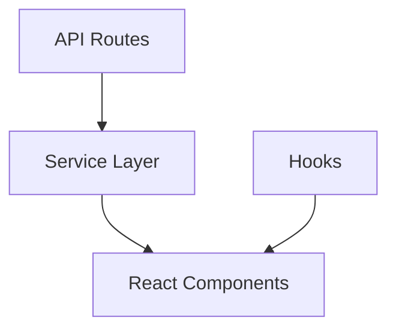

# AI-Assisted Coding Best Practices

## Overview

This guide integrates AI-assisted coding best practices with the existing project management methodology used in the PointMe project. It provides a systematic approach to maximize productivity when working with AI coding assistants while maintaining project continuity and code quality.

## Core Components

### 1. Project Context Management

#### 1.1 Using .cursorrules for Context and Consistency
- **Purpose**: Provide AI assistants with consistent project context
- **Implementation**:
  - Create a `.cursorrules` file in the project root
  - Include project overview, coding standards, and file organization
  - Update rules as the project evolves
  
#### 1.2 Documentation Structure
- **Purpose**: Maintain comprehensive documentation for both AI and human collaborators
- **Key Documents**:
  - Implementation Roadmap (`IMPLEMENTATION_ROADMAP.md`)
  - Progress Tracking (`PROGRESS.md`)
  - Session Summaries (`COMPOSER_SESSION_SUMMARY.md`)
  - Component Documentation (README files in each directory)

### 2. AI Interaction Workflow

#### 2.1 Query Refinement
- **Purpose**: Maximize the effectiveness of AI assistance
- **Best Practices**:
  - Provide detailed prompts with specific context
  - Include file paths and expected outputs
  - Iterate on queries by adding specifics if initial suggestions are unhelpful
  - Reference existing documentation in queries

#### 2.2 Code Review Process
- **Purpose**: Ensure quality of AI-generated code
- **Key Steps**:
  - Verify logic before implementing suggestions
  - Test thoroughly using unit tests or integration tests
  - Debug AI-generated solutions when they fail
  - Document any patterns of AI errors for future reference

### 3. Progress Tracking System

#### 3.1 Task Categorization
```markdown
## Completed Tasks
- [x] Task description with completion date

## In Progress
- [ ] Task description with current status

## Next Steps
1. Immediate next action
2. Subsequent actions
```

#### 3.2 AI Assistance Tracking
```markdown
## AI Contributions
- [x] Code refactoring with AI assistance (date)
- [x] Bug fixing with AI assistance (date)

## AI Learning Points
- Noted pattern: AI struggles with complex type assertions
- Improvement: Providing file context improves code generation quality
```

### 4. Implementation Rules

#### 4.1 Code Organization
- Maintain consistent file structure
- Use index files for clean exports
- Follow naming conventions
- Implement proper type definitions

#### 4.2 Documentation Requirements
- Update relevant documentation files after each major change
- Include implementation details in code comments
- Maintain changelog for significant updates
- Document AI-assisted changes separately

### 5. Development Workflow

#### 5.1 Session Start
1. Review current status in `PROGRESS.md`
2. Check next steps in `IMPLEMENTATION_ROADMAP.md`
3. Prepare context for AI assistance (relevant files, requirements)

#### 5.2 During Development with AI
1. Follow implementation rules
2. Provide clear, specific queries to AI
3. Review and test AI-generated code thoroughly
4. Track progress in real-time

#### 5.3 Session End
1. Update `PROGRESS.md` with completed tasks
2. Update `IMPLEMENTATION_ROADMAP.md` if timeline changes
3. Document any blockers or issues
4. Create a session summary with AI contribution details

## Example .cursorrules File

```
---
description: PointMe Project Implementation Guidelines
globs: ["**/*"]
alwaysApply: true
priority: 1
---

### Project Overview
PointMe is a Next.js application with TypeScript that provides [brief description].

### Architectural Patterns


### Code Standards
- Use PascalCase for component names
- Use camelCase for variables and functions
- Prefer functional components with hooks
- Implement proper type definitions (avoid 'any')

### File Organization
- src/components: UI components
- src/lib: Core services and utilities
- src/hooks: Custom React hooks
- src/app: Next.js app router pages

### Critical Considerations
- Toast notifications use ToastService (not ToastService.toast)
- Authentication uses centralized AuthService
- Error handling follows centralized pattern
```

## Best Practices for AI-Assisted Coding

### 1. Avoid Over-Reliance
- Practice manual debugging techniques
- Regularly review AI-generated code for errors or inefficiencies
- Understand the code before implementing it

### 2. Debugging Workflow
- Verify logic before implementing AI suggestions
- Test thoroughly using unit tests or integration tests
- Debug AI-generated solutions when they fail

### 3. Refine Queries
- Provide detailed prompts with context (file paths, expected outputs)
- Iterate on queries by adding specifics if initial suggestions are unhelpful
- Reference existing code patterns in your queries

### 4. Maintain Documentation
- Use README files to explain component functionality
- Add comments and docstrings in code to clarify complex logic
- Document AI-assisted changes for future reference

## Implementation Example

### 1. Starting a Session with AI Assistance

```markdown
# Session Preparation

## Current Status
- Project Phase: Component Standardization
- Current Focus: TextArea vs Textarea casing issue

## Context for AI
- Related files: src/components/ui/TextArea.tsx, src/components/ui/index.ts
- Issue: Inconsistent component naming (TextArea vs Textarea)
- Goal: Standardize to PascalCase (TextArea) and update all references
```

### 2. During Development

```markdown
# AI Interaction Log

## Query 1
"Help me identify all references to the Textarea component that need to be updated to TextArea"

## AI Response
- Found 12 references in 8 files
- Suggested search pattern: `import.*Textarea|Textarea[^A-Za-z]`

## Implementation
- Created script to update references
- Manually verified changes in critical components
```

### 3. Session Completion

```markdown
# Session Summary

## Completed Tasks
- [x] Standardized TextArea component naming
- [x] Updated all references to use consistent casing
- [x] Added documentation for component naming conventions

## AI Contribution
- Helped identify all references needing updates
- Suggested search pattern for finding inconsistent usage
- Assisted in creating update script

## Next Steps
1. Address remaining component naming inconsistencies
2. Update import statements in affected files
```

## Conclusion

This integrated approach combines structured project management with effective AI collaboration practices. By maintaining clear documentation, providing proper context to AI assistants, and following a systematic workflow, you can maximize productivity while ensuring code quality and project continuity.

Remember to:
1. Maintain comprehensive project context
2. Provide specific, detailed queries to AI
3. Review and test AI-generated code thoroughly
4. Document progress and AI contributions
5. Avoid over-reliance on AI assistance

This methodology helps maintain project continuity across development sessions, ensures consistent implementation of features, and maximizes the benefits of AI-assisted coding while mitigating potential pitfalls. 