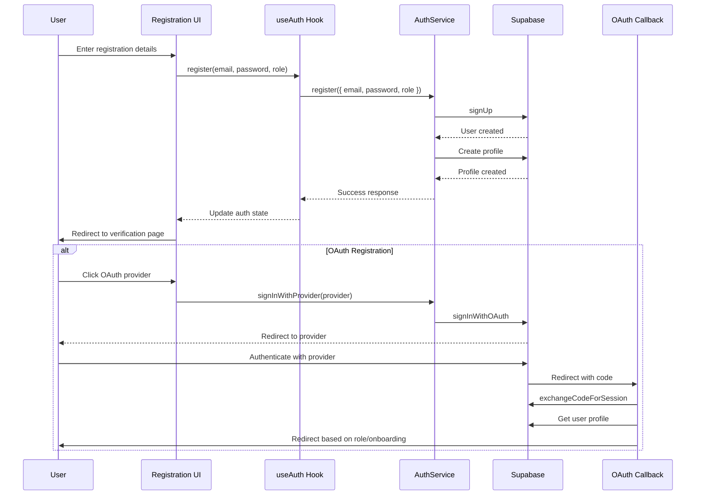
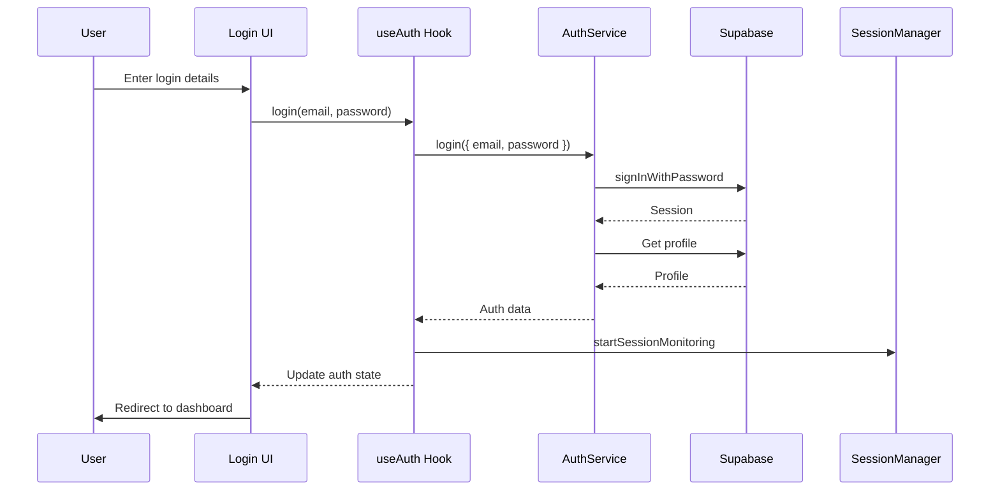
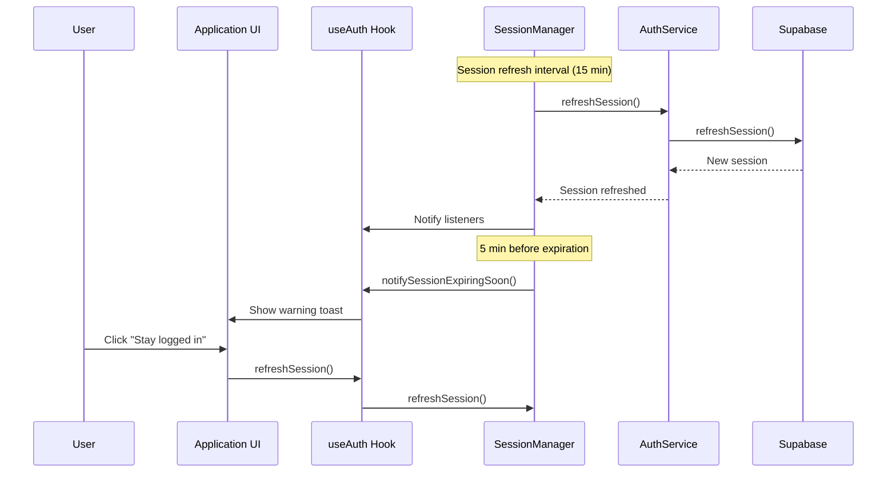

# Authentication System Audit

## Overview

This document provides a comprehensive audit of the PointMe authentication system, identifying current implementation issues, redundancies, and recommendations for improvement.

## Current Architecture

The authentication system is currently implemented across multiple files and directories with some duplication and parallel implementations:

### Core Components

1. **Auth Services**:
   - `src/lib/supabase/services/auth/auth.service.ts` - Comprehensive implementation (singleton pattern)
   - `src/lib/core/auth/auth-service.ts` - Simplified implementation (static methods, deprecated)

2. **Auth Hooks**:
   - `src/hooks/auth/useAuth.ts` - Primary hook for authentication state and methods
   - `src/hooks/auth/useAuthService.ts` - Deprecated hook that forwards to the core auth service

3. **Session Management**:
   - `src/lib/auth/session-manager.ts` - Handles session refresh and expiration

4. **OAuth Callback**:
   - `src/app/auth/callback/route.ts` - Handles OAuth provider callbacks

5. **Error Handling**:
   - `src/lib/error/auth-error-utils.ts` - Converts Supabase errors to application errors
   - `src/lib/error/auth-error-converter.ts` - Similar functionality, potential duplication

## Issues Identified

### 1. Service Duplication

There are two auth service implementations:
- The comprehensive implementation in `src/lib/supabase/services/auth/auth.service.ts`
- The simplified implementation in `src/lib/core/auth/auth-service.ts`

While the simplified implementation is marked as deprecated and forwards calls to the comprehensive service, this creates unnecessary complexity and potential for confusion.

### 2. Hook Duplication

Similarly, there are two auth hooks:
- `useAuth` - The primary hook
- `useAuthService` - A deprecated hook that forwards to the core auth service

### 3. Error Handling Duplication

There appear to be two similar utilities for handling auth errors:
- `src/lib/error/auth-error-utils.ts`
- `src/lib/error/auth-error-converter.ts`

### 4. OAuth Callback Implementation

The OAuth callback implementation in `src/app/auth/callback/route.ts` directly uses the Supabase client instead of going through the auth service, which breaks the service abstraction pattern.

### 5. Inconsistent Session Management

Session management is handled in multiple places:
- In the `useAuth` hook
- In the `SessionManager` class
- Potentially in the auth services

### 6. Type Inconsistencies

There are potential inconsistencies in how auth-related types are defined and used across the codebase.

## Recommendations

### 1. Consolidate Auth Services

1. **Remove the deprecated auth service**:
   - Identify all places where `src/lib/core/auth/auth-service.ts` is imported
   - Replace with imports from `src/lib/supabase/services/auth/auth.service.ts`
   - Remove the deprecated service file

2. **Standardize on the singleton pattern**:
   - Ensure all services use the singleton pattern consistently
   - Remove static helper methods in favor of the singleton instance

### 2. Consolidate Auth Hooks

1. **Remove the deprecated hook**:
   - Identify all places where `useAuthService` is imported
   - Replace with imports of `useAuth`
   - Remove the deprecated hook file

### 3. Standardize Error Handling

1. **Consolidate error utilities**:
   - Merge functionality from `auth-error-utils.ts` and `auth-error-converter.ts`
   - Standardize on a single approach for error conversion

### 4. Refactor OAuth Callback

1. **Use the auth service in the OAuth callback**:
   - Refactor `src/app/auth/callback/route.ts` to use the auth service
   - Ensure proper error handling and logging

### 5. Centralize Session Management

1. **Ensure session management is centralized**:
   - Use the `SessionManager` consistently throughout the codebase
   - Remove any duplicate session management logic

### 6. Standardize Types

1. **Create a comprehensive set of auth-related types**:
   - Ensure all auth-related types are defined in a single location
   - Use these types consistently throughout the codebase

## Implementation Plan

### Phase 1: Audit and Documentation

1. **Complete this audit document**
2. **Map all auth-related imports** to identify usage patterns
3. **Document the ideal auth flow** for each user type

### Phase 2: Consolidation

1. **Consolidate error handling utilities**
2. **Refactor OAuth callback** to use the auth service
3. **Centralize session management**

### Phase 3: Removal of Deprecated Components

1. **Replace all imports of deprecated components**
2. **Remove deprecated components**
3. **Update documentation**

### Phase 4: Testing and Validation

1. **Test all auth flows**:
   - Registration
   - Login (email/password)
   - OAuth login
   - Password reset
   - Session management
   - Logout
2. **Validate error handling**
3. **Ensure proper redirection based on user role**

## Auth Flow Diagrams

### Registration Flow

### Login Flow

### Session Management

## Conclusion

The current authentication system has several redundancies and parallel implementations that should be consolidated. By following the recommendations in this audit, we can create a more maintainable, consistent, and robust authentication system that follows best practices and provides a seamless user experience. 