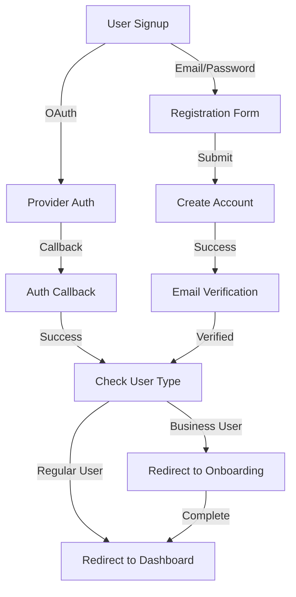
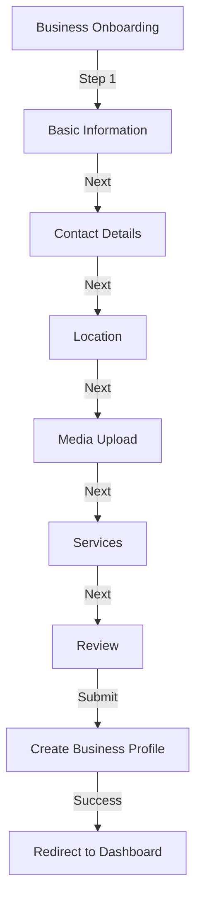

# Registration and Onboarding Process Audit

## Overview

This document provides a comprehensive audit of the registration and onboarding process in the PointMe application, identifying functional issues that need to be addressed before organizational improvements.

## Architecture

The registration and onboarding process involves several components:

1. **Authentication System**
   - Two implementations: `auth-service.ts` (core) and `auth.service.ts` (supabase)
   - OAuth integration via Supabase
   - Email verification flow

2. **Onboarding Wizard**
   - Multi-step form process
   - Local storage persistence
   - Business profile creation

3. **Data Services**
   - Business category fetching
   - Service category fetching
   - Profile creation and updating

## Critical Issues

### 1. Registration Flow Issues

#### 1.1 Auth Service Duplication
- **Issue**: Two competing implementations cause confusion and potential conflicts
- **Impact**: Developers may use the wrong service, leading to inconsistent behavior
- **Fix Priority**: High

#### 1.2 OAuth Callback Handling
- **Issue**: The OAuth callback (`src/app/auth/callback/route.ts`) lacks proper error handling
- **Impact**: Users may get stuck in authentication limbo if errors occur
- **Fix Priority**: High

#### 1.3 Role-Based Redirection
- **Issue**: Registration doesn't properly redirect business users to onboarding
- **Impact**: Business users may not complete the required onboarding process
- **Fix Priority**: Critical

#### 1.4 Email Verification
- **Issue**: Inconsistent error messages during email verification
- **Impact**: Users may abandon registration due to confusion
- **Fix Priority**: Medium

### 2. Onboarding Process Issues

#### 2.1 Data Persistence
- **Issue**: Reliance on local storage for form data persistence
- **Impact**: Users lose progress if they clear browser data or switch devices
- **Fix Priority**: High

#### 2.2 Step Validation
- **Issue**: Inconsistent validation across onboarding steps
- **Impact**: Invalid data may be submitted or users may get stuck
- **Fix Priority**: High

#### 2.3 Error Handling
- **Issue**: Missing error handling for API failures during onboarding
- **Impact**: Silent failures lead to user confusion
- **Fix Priority**: High

#### 2.4 Server-Side Validation
- **Issue**: Lack of server-side validation for submitted data
- **Impact**: Potential security issues and data integrity problems
- **Fix Priority**: Medium

### 3. UI/UX Issues

#### 3.1 Loading States
- **Issue**: Inconsistent loading indicators during registration/onboarding
- **Impact**: Users may submit forms multiple times or abandon the process
- **Fix Priority**: Medium

#### 3.2 Error Messaging
- **Issue**: Generic error messages don't provide actionable information
- **Impact**: Users can't resolve issues on their own
- **Fix Priority**: Medium

#### 3.3 Progress Indication
- **Issue**: Limited feedback on onboarding progress
- **Impact**: Users may abandon a lengthy process without clear progress indicators
- **Fix Priority**: Low

## Detailed Analysis

### Registration Flow



#### Current Implementation Issues:

1. The `useAuthService` hook in `src/hooks/auth/useAuthService.ts` uses the simplified auth service, while other parts of the application use the comprehensive one.

2. The OAuth callback in `src/app/auth/callback/route.ts` doesn't check the user type before redirecting, potentially bypassing the onboarding process for business users.

3. Email verification lacks proper error handling and user feedback.

### Onboarding Process



#### Current Implementation Issues:

1. The `useBusinessOnboarding` hook in `src/hooks/business/useBusinessOnboarding.ts` uses local storage for persistence without server-side backup.

2. Form validation in `BusinessOnboardingWizard.tsx` is inconsistent across steps.

3. Error handling for API calls in `business-onboarding-service.ts` doesn't provide user-friendly messages.

4. No server-side validation before creating the business profile.

## Recommended Fixes

### Immediate Fixes (Critical)

1. **Fix Role-Based Redirection**
   - Update the auth callback route to check user role and redirect business users to onboarding
   - Implement in: `src/app/auth/callback/route.ts`

2. **Improve Data Persistence**
   - Add server-side storage for onboarding progress
   - Implement in: `src/lib/supabase/services/business/business-onboarding-service.ts`

3. **Enhance Error Handling**
   - Add comprehensive error handling for all API calls
   - Implement in: All service files and hooks

### Short-Term Fixes (High Priority)

1. **Consolidate Auth Services**
   - Choose one implementation (preferably the comprehensive one)
   - Update all imports and usages

2. **Implement Consistent Validation**
   - Create reusable validation functions
   - Apply to all onboarding steps

3. **Add Server-Side Validation**
   - Implement validation in API routes and services

### Medium-Term Improvements

1. **Enhance User Feedback**
   - Improve error messages with actionable information
   - Add better progress indicators

2. **Implement Automated Testing**
   - Add end-to-end tests for the registration and onboarding flows
   - Create unit tests for validation functions

## Implementation Plan

### Phase 1: Critical Fixes

1. **Fix Role-Based Redirection**
   ```typescript
   // src/app/auth/callback/route.ts
   export async function GET(request: NextRequest) {
     // ... existing code ...
     
     try {
       const cookieStore = cookies() as unknown as CookieContainer;
       const supabase = await supabaseClientService.getServerClient(cookieStore);
       
       // Exchange code for session
       await supabase.auth.exchangeCodeForSession(code);
       
       // Get user profile to check role
       const { data: { user } } = await supabase.auth.getUser();
       
       if (user) {
         // Get profile to check if business user
         const { data: profile } = await supabase
           .from('profiles')
           .select('role, onboarding_completed')
           .eq('id', user.id)
           .single();
         
         // If business user and onboarding not completed, redirect to onboarding
         if (profile?.role === 'business' && !profile?.onboarding_completed) {
           return NextResponse.redirect(new URL(ROUTES.businessOnboarding.path, requestUrl.origin));
         }
       }
       
       // Default redirect to dashboard
       return NextResponse.redirect(new URL(ROUTES.dashboard.path, requestUrl.origin));
     } catch (error) {
       // ... error handling ...
     }
   }
   ```

2. **Improve Data Persistence**
   ```typescript
   // src/lib/supabase/services/business/business-onboarding-service.ts
   async saveOnboardingProgress(businessId: string, data: any): Promise<BusinessOnboardingStepResponse<any>> {
     return supabaseClientService.executeWithRetry(async (client) => {
       try {
         // Save to onboarding_progress table
         const { data: savedData, error } = await client
           .from('onboarding_progress')
           .upsert({
             business_id: businessId,
             data: data,
             updated_at: new Date().toISOString()
           }, {
             onConflict: 'business_id'
           });
         
         if (error) throw error;
         
         return {
           data: savedData,
           error: null
         };
       } catch (error) {
         return {
           data: null,
           error: this.handleError(error, 'Failed to save onboarding progress')
         };
       }
     });
   }
   
   async getOnboardingProgress(businessId: string): Promise<BusinessOnboardingStepResponse<any>> {
     return supabaseClientService.executeWithRetry(async (client) => {
       try {
         const { data, error } = await client
           .from('onboarding_progress')
           .select('data')
           .eq('business_id', businessId)
           .single();
         
         if (error && error.code !== 'PGRST116') throw error;
         
         return {
           data: data?.data || null,
           error: null
         };
       } catch (error) {
         return {
           data: null,
           error: this.handleError(error, 'Failed to get onboarding progress')
         };
       }
     });
   }
   ```

### Phase 2: Documentation and Standards

1. **API Documentation**
   - Implement OpenAPI/Swagger for all API routes
   - Add JSDoc comments to all service methods

2. **Code Documentation**
   - Add comprehensive docstrings to all functions and classes
   - Create README files for all directories

3. **Automation**
   - Set up TypeDoc for documentation generation
   - Implement ESLint rules for enforcing standards

## Conclusion

The registration and onboarding process has several critical functional issues that need to be addressed before organizational improvements. By focusing on the high-priority fixes outlined in this audit, we can ensure a smooth user experience while laying the groundwork for future improvements.

The most critical issues are:
1. Role-based redirection after OAuth authentication
2. Data persistence during the onboarding process
3. Error handling and validation

Addressing these issues will significantly improve the user experience and reduce support requests related to registration and onboarding. 