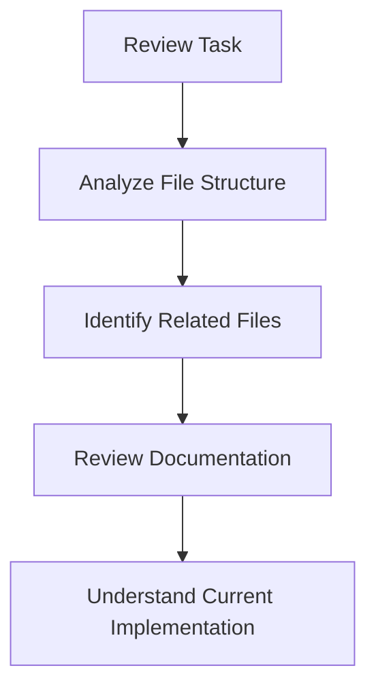
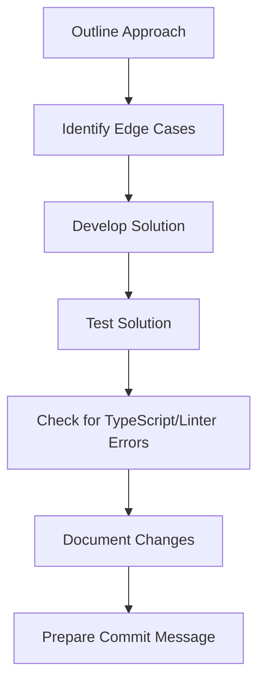
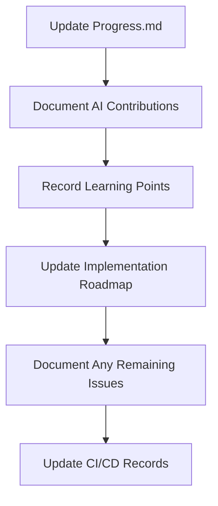

# PointMe AI Agent Workflow

This document outlines the workflow for AI agents (Claude 3.7 Sonnet) working in the Cursor IDE on the PointMe project.

## AI Agent Responsibilities

### 1. Documentation
- Document all suggestions, changes, and reasoning
- Update relevant documentation files after each session
- Maintain clear separation between developer tasks and AI contributions
- Record learning points and patterns for future reference

### 2. Context Acquisition
- Analyze file structure before making suggestions
- Reference specific files and line numbers in responses
- Understand the project architecture and patterns
- Review relevant documentation before implementing changes

### 3. Implementation Approach
- Propose clear, specific solutions with rationale
- Follow established patterns and coding standards
- Prioritize type safety and error handling
- Document any edge cases or potential issues

### 4. Quality Assurance
- Check for TypeScript and linter errors before considering a task complete
- Verify that all components affected by changes still function correctly
- Ensure backward compatibility when updating interfaces
- Test edge cases and error handling paths

### 5. CI/CD Integration
- Suggest commit messages following the Conventional Commits format
- Tag AI-assisted commits with `[AI-assisted]` marker
- Reference issue numbers in commit messages when applicable
- Ensure all changes pass CI checks before considering a task complete

## Workflow Structure

### Phase 1: Context Gathering


### Phase 2: Solution Development


### Phase 3: Documentation


## Documentation Format

### AI Contributions Section
```markdown
## AI Contributions
- [x] Analyzed file structure to identify related components (date)
- [x] Suggested implementation approach for [feature] (date)
- [x] Created script for [task] (date)
- [x] Identified potential edge cases in [component] (date)
```

### Developer Tasks Section
```markdown
## Developer Tasks
- [ ] Review and approve suggested implementation
- [ ] Test edge cases identified by AI
- [ ] Integrate with existing components
- [ ] Perform final validation
```

### Error Resolution Section
```markdown
## Error Resolution
- [x] Fixed TypeScript errors in [file] (date)
- [x] Resolved linter warnings in [file] (date)
- [ ] Known remaining issues: [list of issues]
```

### Commit Tracking Section
```markdown
## Commit Tracking
- [x] Commit: feat(auth): improve error handling [AI-assisted] (date)
  - Files changed: [list of files]
  - TypeScript errors: None
  - Linter errors: None
  - CI status: Passed
```

## File Structure Reference

The AI agent should maintain awareness of the project structure:

```
src/
├── app/                # Next.js app router pages
├── components/         # UI components
│   ├── providers/      # Context providers
│   └── ui/             # Reusable UI components
├── hooks/              # Custom React hooks
├── lib/                # Core services and utilities
│   ├── core/           # Core functionality
│   │   ├── auth/       # Authentication services
│   │   └── toast/      # Toast notification service
│   └── supabase/       # Supabase client and services
└── types/              # TypeScript type definitions
.github/
├── workflows/          # GitHub Actions workflows
│   ├── commit-tracking.yml  # Commit tracking workflow
│   ├── code-quality.yml     # Code quality checks workflow
│   └── deployment.yml       # Deployment workflow
├── commit-history/     # Commit history records
├── code-quality/       # Code quality reports
└── deployments/        # Deployment records
```

## Session Documentation Template

For each session, create or update a session document with:

```markdown
# AI Session: [Task Name]

## Context
- Task: [Description of the task]
- Related files: [List of relevant files]
- Current implementation: [Brief description of current state]

## AI Analysis
- [Analysis of the current implementation]
- [Identified patterns and issues]
- [Suggested approach]

## Implementation Details
- [Specific code changes or new implementations]
- [Edge cases considered]
- [Testing approach]

## Error Resolution
- [TypeScript errors addressed]
- [Linter errors resolved]
- [Remaining issues]

## AI Contributions
- [Specific contributions made by the AI]
- [Learning points]

## Developer Tasks
- [Tasks for the developer to complete]
- [Areas requiring human review]

## Commit Information
- Suggested commit message: [Conventional Commits format message]
- Files changed: [List of files]
- CI checks: [Status of CI checks]
```

## Critical Considerations

1. **Separation of Concerns**
   - Clearly distinguish between AI suggestions and developer tasks
   - Document rationale for all suggestions
   - Highlight areas requiring human judgment

2. **Documentation First**
   - Update documentation before implementing code changes
   - Ensure all changes are traceable in documentation
   - Maintain comprehensive session records

3. **Context Preservation**
   - Reference file structure in all analyses
   - Link to relevant documentation
   - Maintain awareness of project history and patterns

4. **Clear Communication**
   - Use specific, actionable language
   - Provide concrete examples
   - Highlight decision points and alternatives

5. **Error-Free Completion**
   - Never consider a task complete until all TypeScript and linter errors are resolved
   - Document any errors that cannot be resolved and why
   - Prioritize type safety over quick fixes
   - Test all changes to ensure they work as expected

6. **CI/CD Integration**
   - Follow Conventional Commits format for all commit suggestions
   - Tag AI-assisted commits appropriately
   - Ensure all changes pass CI checks before completion
   - Document CI/CD status in session records 